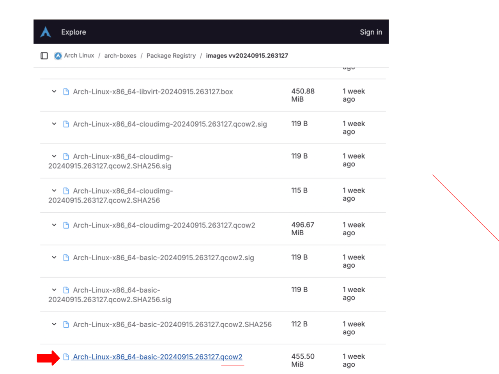
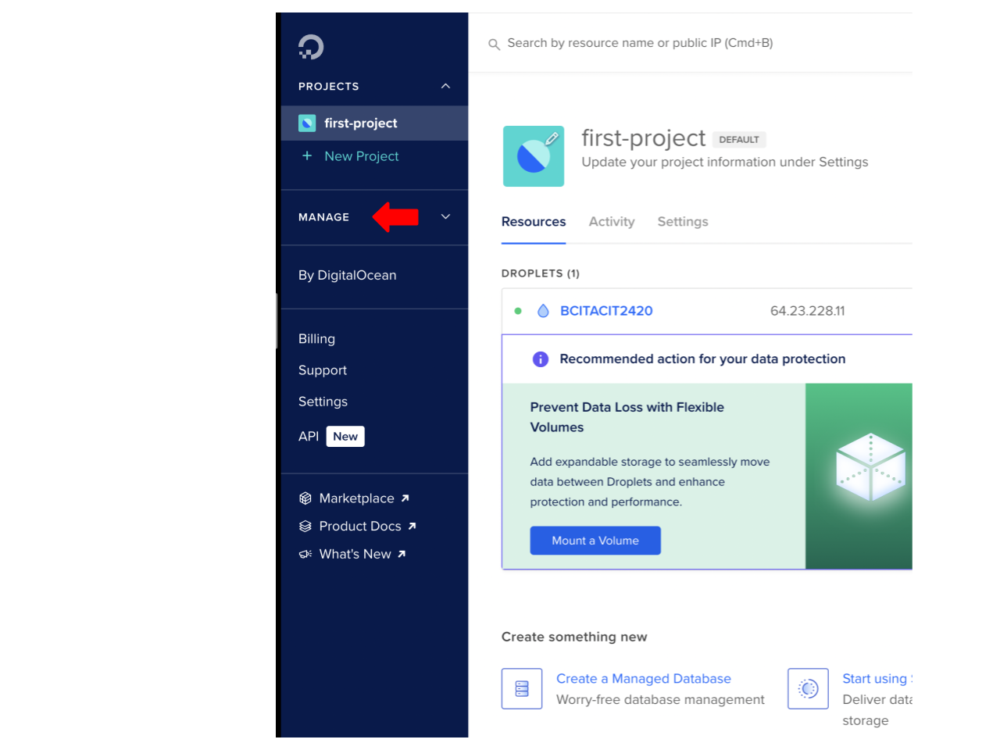

## Creating a Remote Server with DigitalOcean using doctl (MacOs)

## Table of Contents

1. Introduction
2. Instructions
3. Uploading Arch Linux Image to DigitalOcean
4. Creating SSH Key Pair 
5. Installing ```doctl```
6. Creating an API Token
7. Using The API Token to Grant access to doctl
8. Adding public key to your DigitalOcean Account 
9. Configuration of The Cloud Init File
10. Deployment of Droplet with Cloud-init

Use <br>

## Introduction

In this tutorial, we will walk through the process of creating a remote server on DigitalOcean using the doctl command-line tool. We will utilize cloud-init to automate the initial configuration of the server, including user creation, package installation, and SSH key setup.

## Instructions

The following instructions will guide you through the stages necessary for configuring the droplet with SSH keys and the doctl.


### Uploading Arch Linux Image 

1. Download the latest **Arch Linux** image from 

(https://gitlab.archlinux.org/archlinux/arch-boxes/-/packages/) with the .qcow2 file extension, labeled as cloudimg. 



2. Go to Digital Ocean and click **manage**



3. Click **Backups & Snapshots** on the dropdown menu


4. Click **Custom Images**

5. Click **Upload Images** and select Arch Linux Image and open the file

6. Click on **distribution** and select Arch Linux


7. Select your closest region


8. **Click** Upload Image

Your Arch Linux image has been successfully uploaded to DigitalOcean!

### Creating SSH Keys

SSH keys allow you to securley connect to your Droplet, and they are safer than passwords since the private key remains on your computer.
a
1. Open your Terminal 

2. Type ```cd``` to see change to your user home directory

3. Type ```mkdir .ssh``` to create a directory called .ssh 

4. ```cd``` into .ssh to navigate to the newly opened directory. 

(image)


NOTE: Run ls -a to confirm if .ssh has been made.


5. Type ```ssh-keygen -t ed25519 -f ~/.ssh/do-key -C "your email address"``` and **enter** to generate a new SSH key pair 

* ```ssh-keygen``` command generates a SSH key pair

* ```-t ed 25519``` specifies that the Ed25519 is the key type to create, as its known for its security

* ```f ~/.ssh/do-key``` assigns the filename for the private key (do-key) in the .ssh directory; the public key will have the .pub extension by default.

* ```-C``` adds a comment to the key, often for identification, such as your email address.

NOTE: Change "your email address" to your email of choice and you can change do-key name, for example hello-key

6. Press **enter** and type a passphrase or press **enter** for no passphrase

7. Type ```cd .ssh``` then use ```ls``` to confirm your authorized keys

(image)

### Installing DOCTL 

1. Open your Terminal

2. Install Homebrew on your MacOs by copying the following command

``` 
/bin/bash -c "$(curl -fsSL https://raw.githubusercontent.com/Homebrew/install/HEAD/install.sh)"

```
* ```/bin/bash -c....``` downloads and executes HomeBrews installation

3. Once installed, Type and run the following **command**

```
brew install doctl
``` 
* ```Brew install doctl``` command uses Homebrew to install the DigitalOcean command-line tool (doctl).

(image)

4.Type ```doctl version``` once installed to verify the installation

* ```doctl version``` displays the version of doctl that is currently installed and verifies the installation.


```doctl``` has been installed successfully!

### Creating an API Token

1. Click API on the left hand side of the Menu on DigitalOcean

(image)

2. Click **Generate New Token**

3. Type a **Token Name**, and give it **full access** then click **Generate Token**

(image)

4. Copy and Paste the **token** in a secure storage, file or server. 

NOTE: A **Generated Token** is only shown once.

Your API token has been created!

### Using The API Token to Grant access to doctl

1. Open terminal 

2. Type the following command 

```doctl auth init --context NAME```

* ```doctl auth init``` initalizes doctl with your API token for authentication

* ```--context NAME``` is a parameter that sets a custom name for the context which will help differentiate between multiple configurations.

NOTE: Change **NAME** to something appropiate

3. Copy and Paste your generated token into the terminal 

4. Press Enter and wait for a green checkmark.

Example: Validating token... ✔

(image)

5. Run ```doctl account get``` to validate that doctl is working successfully

* ```doctl account get``` retrieves and displays information about your DigitalOcean account

(image) 

### Adding public key to your DigitalOcean Account using doctl

1. Copy and paste the following commands to add SSH key to DigitalOcean 

```
doctl compute ssh-key create "My SSH Key" --public-key "$(cat ~/.ssh/do-key.pub)"

``` 

NOTE: Replace "do-key" with the name of your SSH key and "My SSH Key" with your preferred name

* ```doctl compute ssh-key create``` command creates a new SSH key associated with your DigitalOcean account

* ```My SSH Key``` is the name you assign to your SSH key

* ```--public-key "$(cat ~/.ssh/do-key.pub)"``` specifies the public key to be uploaded by reading it from the local file. The $(cat ~/.ssh/do-key.pub) retrieves the contents of your public key file.

2. Press Enter 

(image)

3. Go to DigitalOcean and **click** settings. 

(image)

3. Click security and see if your key is uplodaed

(image)


### Configuration of The Cloud Init File 

**install neovim** 

``` brew install neovim
```

1. Type the following command to create a file

```nvim cloud-config.yaml```

2. Copy and Paste the following content into the **file**, then pres i for "insert mode"
#
#cloud-config
users:
  - name: example-user
    shell: /bin/bash
    sudo: ['ALL=(ALL) NOPASSWD:ALL']
    ssh_authorized_keys:
      - <your public SSH Key>
disable_root: true
packages:
  - nginx
runcmd:
  - 'export PUBLIC_IPV4=$(curl -s http://169.254.169.254/metadata/v1/interfaces/public/0/ipv4/address)'
  - 'echo Droplet: $(hostname), IP Address: $PUBLIC_IPV4 > /var/www/html/index.html'

3. Change name to your name

4. Change gh:<your public SSH Key> with your SSH Key

NOTE: Remove <>

(image)

5. Press esc to exit Insert Mode and type :wq to save and exit nvim

(image)

go to home and see if the yaml file is made

### Deployment of Droplet with Cloud-init

1. Open Terminal 

2. Type or Copy the following command, then locate your key ID

``` doctl compute ssh-key list ```

3. Copy and Paste the following into the terminal

4. Use the command below to check list of image

```doctl compute image list-user```

5. Run the followig command to create your droplet

``` 
doctl compute droplet create --image 165064169 --size s-1vcpu-1gb --region sfo3 --ssh-keys < git-user > --user-data-file < path-to-your-cloud-init-file > --wait first-droplet 
 
```
NOTE: Change < git-user > with your ID number from step 2

Replace  < path-to-your-cloud-init-file > to the path of your cloud-config.yaml file

(image)

6. Press Enter 

NOTE: This command may take a minute

(image)

7. Type the following command to verify if it worked

``` doctl compute droplet list ```

then copy the following command to connect to your droplet

``` ssh -i < /path/to/private-key > username@your-droplet-ip ```

fix problem above, fixed


NOTE: if ``` [Example@first-droplet ~]$ ``` appears you have successfully connected to your droplet


